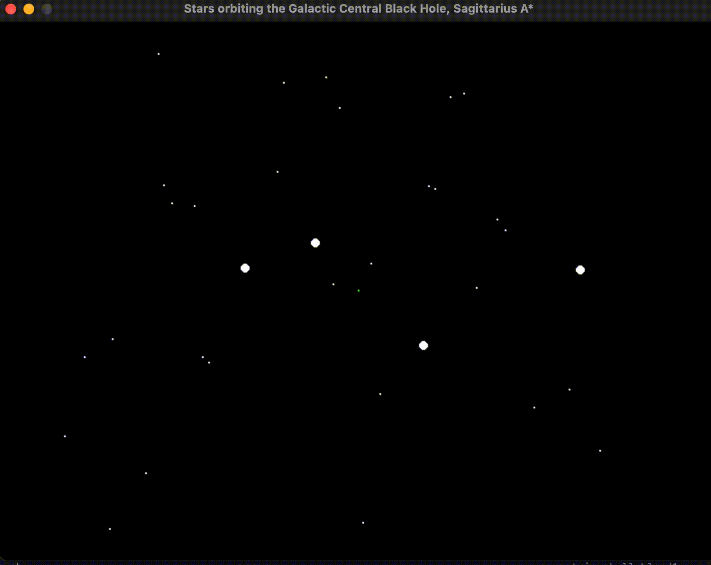

# sagittarius_a_orbits
<pre>

Hypothetical (masses aren't accurate, distances not accurate) sim
of the orbits of stars around the supermassive black hole at the 
center of the Milky Way galaxy, sgr A*. 

</pre>

~~TODO 1: ffmpeg script in bash for gif creation.~~  
TODO 2: use astropy for constants.  
TODO 3: mess with orbital eccentricities and semimajor axes.  
~~TODO 4: add background stars.~~
TODO 5: use matplotlib for this instead of pygame.  

