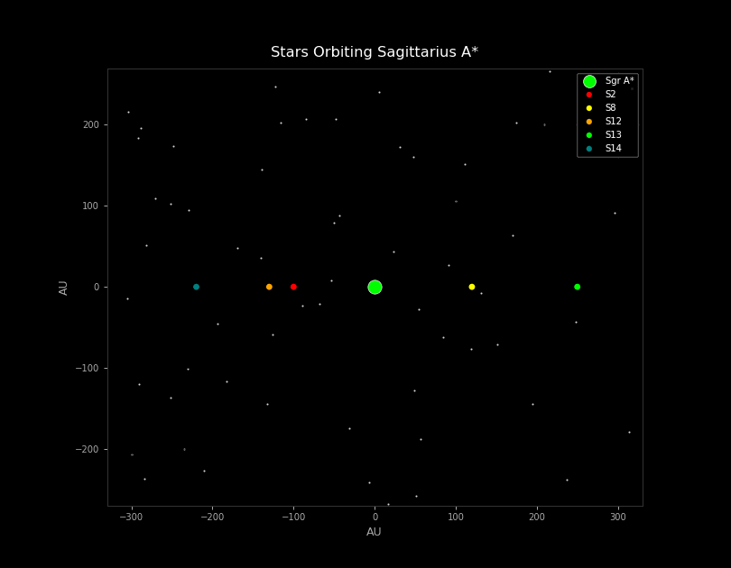
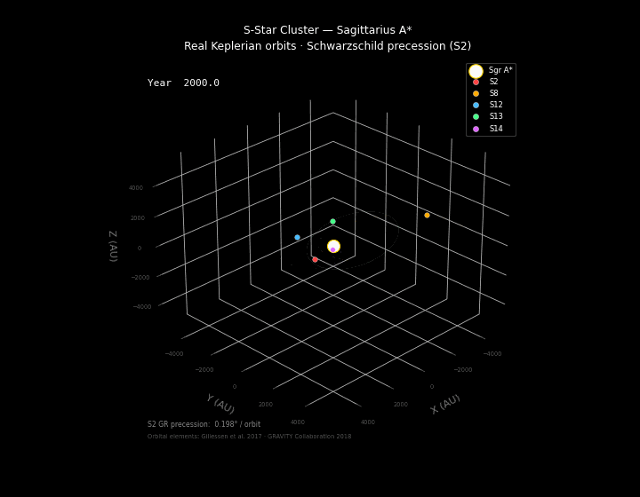

# Sagittarius A* Orbit Simulator

An N-body gravitational simulation of the S-star cluster orbiting [Sagittarius A*](https://en.wikipedia.org/wiki/Sagittarius_A*) — the supermassive black hole at the center of the Milky Way.

| Rotating view | Fixed view |
|:---:|:---:|
|  |  |

## Overview

This simulation models five real stars from the S-star cluster (S2, S8, S12, S13, S14) under Newtonian gravity, orbiting a central black hole of ~4 million solar masses. Each timestep advances the simulation by 6 hours; the animation spans roughly 2 simulated years.

Masses, distances, and initial velocities are approximate — this is a visualization, not a precision model.

## Physics

- **Gravitational force:** F = Gm₁m₂ / r²
- **Integration:** Euler method, 6-hour timestep
- **Central mass:** 4 × 10⁶ solar masses (scaled ×5 to produce visually interesting orbital periods)
- **Coordinate system:** AU, centered on Sgr A*

## Stack

- Python 3
- [Matplotlib](https://matplotlib.org/) — animation via `FuncAnimation` + `PillowWriter`

## Usage

```bash
pip install matplotlib pillow
python main.py
```

Outputs `sgr_A.gif` directly — no post-processing needed.

## Built with AI

This project started as a pygame prototype written with **ChatGPT** — a good example of how accessible AI coding assistants have made exploratory science projects. It was later rebuilt in matplotlib by **Claude Sonnet 4.6** (via [Claude Code](https://claude.ai/code), Anthropic's agentic coding tool), which rewrote the rendering pipeline, replaced the gif export shell script with native matplotlib output, and updated this README.

The delta between those two tools reflects how quickly the space is moving: from autocomplete-style prompting to a fully agentic workflow that reads your codebase, reasons about tradeoffs, and executes multi-step changes end to end.
